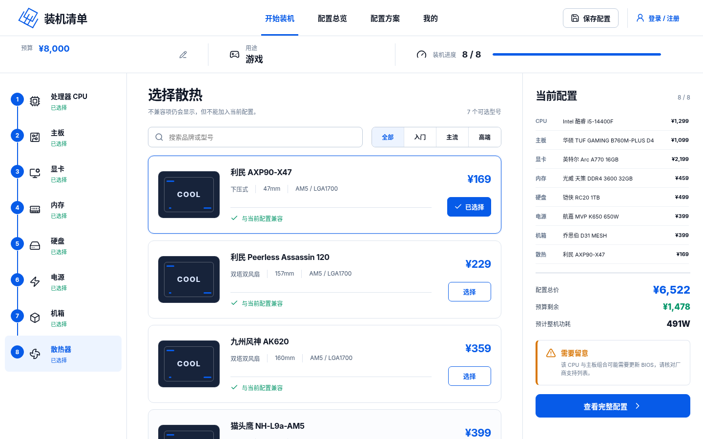
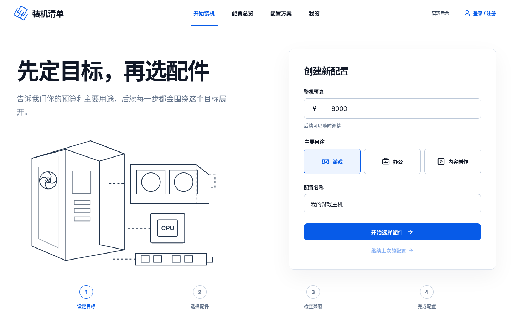
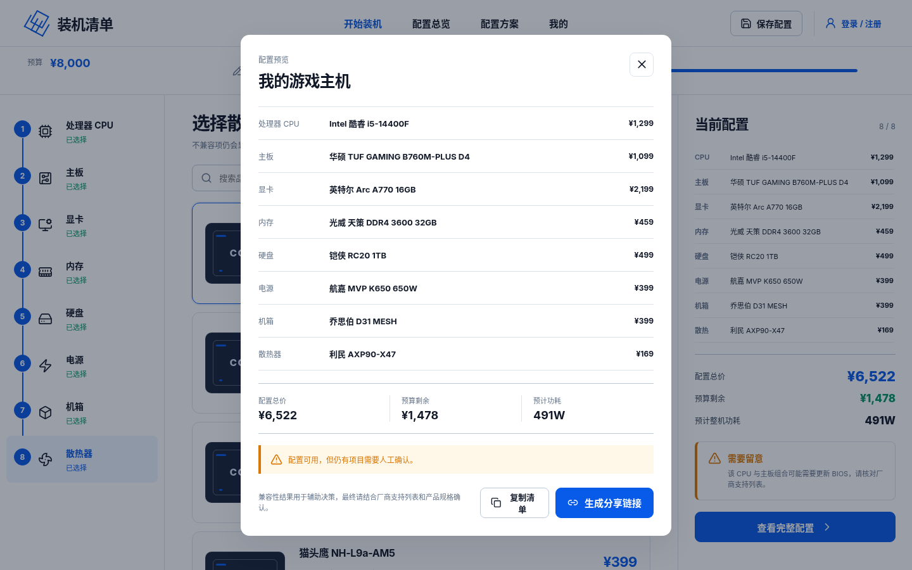
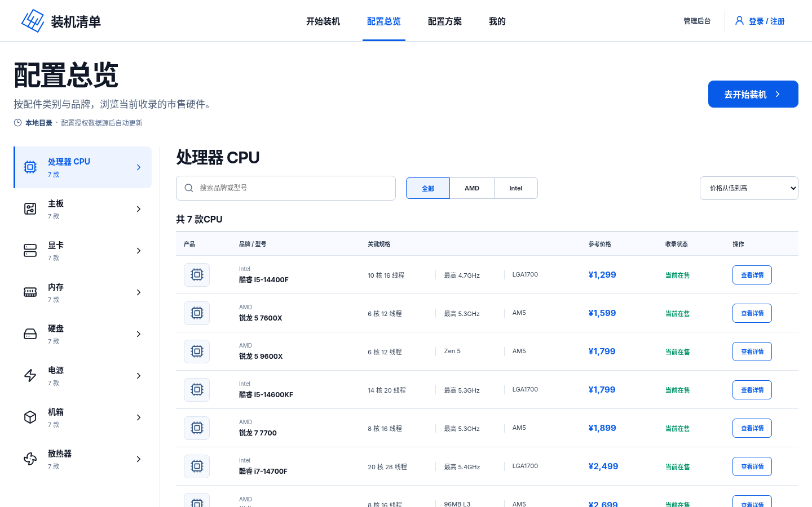
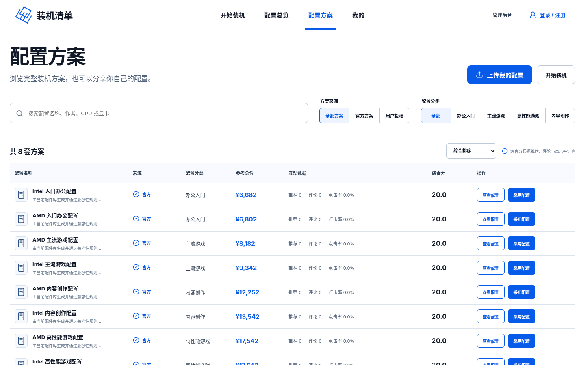
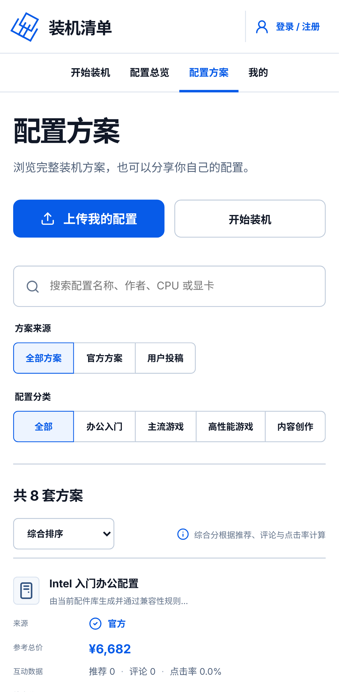

# PC 装机系统 PC_Assembly_System

**简体中文** | [English](README.en.md)




## 简介

PC 装机系统（网页标题为「装机清单 · PC 配置助手」）是一个面向装机新手的网页应用 MVP：先定预算和用途，再按 CPU、主板、显卡、内存、硬盘、电源、机箱、散热器八个步骤挑选配件，每选一个配件都会即时检查兼容性、预算和整机功耗。

除了自己从零开始配，还可以按类别和品牌浏览配件库，查看官方和用户投稿的完整配置方案，一键导入后再微调。注册普通账号后可以上传自己的配置、给方案点推荐或评论，在「我的」里管理个人资料和发布记录。管理员账号和普通账号完全分开，后台可以维护配件和结构化规格。

项目是 TypeScript 全栈的 npm workspaces 单仓库：React 前端、Fastify API、无框架依赖的兼容性和推荐引擎，以及 PostgreSQL 数据库（Drizzle ORM）。不配置数据库时，API 会使用内存数据，克隆下来 `npm install && npm run dev` 就能直接体验。

## 功能特性

**开始装机**
- 设置整机预算（最低 ¥2,000）、主要用途（游戏 / 办公 / 内容创作）和配置名称
- 八步选配件：CPU → 主板 → 显卡 → 内存 → 硬盘 → 电源 → 机箱 → 散热器，可按品牌、型号搜索，按入门 / 主流 / 高端筛选
- 不兼容的配件仍然会显示，但不能加入当前配置
- 右侧实时显示已选配件、配置总价、预算剩余和预计整机功耗

**兼容性检查**（九条规则，规则版本 `2026.09.1`）
- CPU 与主板插槽、CPU 与主板芯片组
- 部分 CPU 与主板组合提示「可能需要更新 BIOS」
- 主板与内存代数（DDR4 / DDR5）、机箱与主板板型（ATX / M-ATX / ITX）
- 显卡长度与机箱限长、散热器高度与机箱限高、散热器与 CPU 插槽
- 电源功率：预计功耗 = CPU 最大功耗 + 其他配件功耗 + 55W 基础功耗，电源额定功率低于预计功耗判定为不兼容，低于 1.35 倍（35% 余量）给出提醒

**保存与分享**
- 草稿保存在当前浏览器（localStorage），下次打开可以「继续上次的配置」
- 一键复制配置单文字
- 选满八类且没有冲突的配置可以生成分享链接（`/builds/<分享码>`）；服务端会重新校验兼容性，数据库里只保存分享码的哈希

**配置总览**
- 按八个类别和品牌浏览配件库，按价格或名称排序，查看配件详情
- 显示目录数据来源和最近更新时间

**配置方案和社区**
- 8 套官方方案：AMD / Intel 各一套「办公入门」「主流游戏」「高性能游戏」「内容创作」，由当前配件库生成并通过兼容性复核
- 用户投稿：登录后可以上传当前配置（必须选满八类），服务端会重新检查在售状态和兼容性
- 按来源、分类、关键词筛选；按综合分、推荐数、评论数、点击率或发布时间排序
- 「采用配置」把方案导入装机页继续调整；可以推荐 / 不推荐、发表评论（最多 500 字）

**账号和「我的」**
- 普通账号注册和登录：用户名 3~24 位小写字母、数字或下划线，密码 8~72 位
- 「我的」页面：编辑显示名称、所在地和简介，查看本地草稿、已发布方案和互动记录

**管理后台**（`/admin/login`）
- 管理员登录后可以搜索、新增、编辑配件，设置上架 / 下架，直接编辑参与兼容性判断的结构化规格 JSON，修改会写入审计日志
- 配置对象存储（S3 兼容）后，可以上传配件图片（JPG / PNG / WebP，最大 5 MB）

**可选：授权目录同步**
- 配置淘宝开放平台授权后，定时核验已收录 CPU、显卡的参考价格和图片地址（最短 15 分钟一次）
- 新发现的型号只写入审核候选表，不会直接进入兼容性判断；没有授权时保持本地目录，不会抓取网页

**安全细节**
- 密码用 Argon2 哈希；会话令牌放在 HttpOnly Cookie 里，服务端只保存令牌的 SHA-256 哈希
- 写操作检查请求来源（`APP_ORIGINS`），登录、注册、投稿、评论等接口有限流
- Docker 部署的 Nginx 配置带安全响应头，访问日志里会隐藏分享码

## 界面截图


| 设定目标 | 选择配件 | 配置预览 |
| :---: | :---: | :---: |
|  |  |  |

| 配置总览 | 配置方案 | 手机版 |
| :---: | :---: | :---: |
|  |  |  |

## 项目结构

```
PC_Assembly_System/
├── apps/
│   ├── web/                    # 前端：React 19 + Vite + React Router + TanStack Query
│   │   ├── src/components/     # 各页面和弹窗：装机、配置总览、配置方案、我的、管理后台……
│   │   ├── src/lib/            # API 调用、本地草稿、官方配置方案库
│   │   └── design-concepts/    # 界面设计稿（PNG）
│   └── api/                    # 后端：Fastify 5 API
│       └── src/
│           ├── app.ts          # 所有路由、登录会话、限流、来源检查
│           ├── store.ts        # 内存存储（没有 DATABASE_URL 时使用）
│           ├── postgres-store.ts  # PostgreSQL 存储
│           ├── catalog-sync.ts    # 淘宝开放平台目录同步
│           ├── image-storage.ts   # S3 兼容对象存储（图片上传）
│           └── engagement-ranking.ts  # 配置方案综合分
├── packages/
│   ├── domain/                 # 无框架依赖：类型、56 个种子配件、九条兼容规则、功耗估算、智能推荐
│   ├── contracts/              # Zod 请求 / 响应校验
│   └── database/               # Drizzle schema、SQL migration、migrate / seed 脚本
├── tests/
│   ├── e2e/                    # Playwright 端到端测试
│   └── *.ps1                   # 文档和部署配置检查（PowerShell）
├── deploy/nginx.conf           # Docker 部署用的 Nginx 配置
├── docs/                       # 技术方案、发布清单
├── PRODUCT_DESIGN.md           # 产品设计文档
├── docker-compose.yml          # PostgreSQL + migrate + seed + API + Web
├── Dockerfile.api / Dockerfile.web
└── .env.example                # 环境变量示例
```

## 快速开始

### 环境要求

- [Node.js](https://nodejs.org/) 24 LTS 和 npm
- PostgreSQL 17（可选，只有 PostgreSQL 模式需要）
- Docker（可选，只有 Docker 方式需要）

### 本地运行（内存数据）

```bash
git clone https://github.com/moyuquan123/PC_Assembly_System.git
cd PC_Assembly_System
npm install
npm run dev
```

打开 http://127.0.0.1:4173 。`npm run dev` 会先编译共享包和 API，再同时启动 API（`127.0.0.1:4174`）和 Vite 前端（`127.0.0.1:4173`，`/api` 请求会代理到 API）。

没有设置 `DATABASE_URL` 时，API 使用内存数据，重启后用户、投稿和分享链接都会清空。开发环境的管理后台默认账号是 `admin / Admin123!`。

### PostgreSQL 模式

先准备一个 PostgreSQL 17 数据库，设置 `DATABASE_URL`，然后执行 migration 和种子数据：

```bash
export DATABASE_URL=postgres://用户名:密码@127.0.0.1:5432/pc_assembly
npm run migrate -w @pc-assembly/database   # 建表，可以重复执行
npm run seed -w @pc-assembly/database      # 写入 8 个类别和 56 个演示配件
npm run dev
```

Windows PowerShell 里用 `$env:DATABASE_URL="postgres://..."` 设置环境变量。

API 只在显式执行 migration 时修改数据库结构。生产环境（`NODE_ENV=production`）不会使用默认管理员密码，必须通过 `ADMIN_BOOTSTRAP_PASSWORD` 注入一个强随机密码。

### Docker 本地体验

```bash
docker compose up --build
```

打开 http://127.0.0.1:8080 。Compose 会等 PostgreSQL 就绪，依次执行 migration 和演示数据 seed，再启动 API 和 Web（Nginx）。`docker-compose.yml` 里的数据库密码和管理员密码只是演示用，不能直接用在公开环境（待确认：Docker 方式在本次整理时没有实际运行过）。

### 配置

API 直接读取进程的环境变量，不会自动加载 `.env` 文件；`.env.example` 列出了所有可用的变量：

| 变量 | 默认值 | 说明 |
| --- | --- | --- |
| `HOST` / `PORT` | `127.0.0.1` / `4174` | API 监听地址和端口 |
| `NODE_ENV` | — | 设为 `production` 时启用 Secure Cookie，并且不再使用默认管理员密码 |
| `DATABASE_URL` | — | PostgreSQL 连接串；不设置就使用内存数据 |
| `APP_ORIGINS` | `http://127.0.0.1:4173,http://localhost:4173` | 允许发起写操作的前端地址，逗号分隔 |
| `ADMIN_BOOTSTRAP_USERNAME` | `admin` | 首次启动时创建的管理员用户名 |
| `ADMIN_BOOTSTRAP_PASSWORD` | 开发环境 `Admin123!` | 首次启动时创建的管理员密码（该用户名已存在时不会修改） |
| `S3_ENDPOINT` `S3_REGION` `S3_BUCKET` `S3_PUBLIC_BASE_URL` `S3_ACCESS_KEY_ID` `S3_SECRET_ACCESS_KEY` | — | 六项都填写后启用后台图片上传（S3 兼容对象存储，示例为腾讯云 COS） |
| `TAOBAO_APP_KEY` `TAOBAO_APP_SECRET` `TAOBAO_ADZONE_ID` | — | 三项都填写后启用淘宝开放平台目录同步 |
| `CATALOG_SYNC_INTERVAL_MINUTES` | `60` | 目录同步周期，最低 15 分钟 |

### 测试与代码检查

```bash
npm run typecheck   # TypeScript 类型检查
npm run lint        # ESLint
npm test            # 各包的 Vitest 单元测试
npm run build       # 编译并构建前端到 apps/web/dist
npm run test:e2e    # Playwright 端到端测试（桌面和手机两种视口）
npm run validate    # 以上全部 + 文档检查 + 部署配置检查
```

端到端测试会优先使用 Windows 上已经安装的 Chrome / Edge，也可以用 `PLAYWRIGHT_CHROMIUM_EXECUTABLE_PATH` 指定浏览器；其他环境第一次运行前请执行 `npx playwright install chromium`。

`npm run validate` 里的 `test:docs` 和 `test:config` 会调用 `powershell` 运行 `tests/*.ps1`，所以需要 Windows 或者装了 PowerShell 的环境。

## API 一览

所有接口返回 `{ requestId, data }` 或 `{ requestId, error: { code, message } }`。

| 接口 | 说明 |
| --- | --- |
| `GET /health/live`、`GET /health/ready` | 存活和就绪检查 |
| `GET /api/v1/categories`、`GET /api/v1/parts`、`GET /api/v1/parts/:id` | 配件类别和配件 |
| `GET /api/v1/catalog/freshness` | 目录数据来源和更新时间 |
| `POST /api/v1/compatibility/check` | 兼容性检查和功耗汇总 |
| `POST /api/v1/recommendations` | 智能推荐：按预算、用途和可选偏好（小体积、静音、方便升级）返回「均衡方案」「性能优先」「性价比优先」三套完整且兼容的配置 |
| `POST /api/v1/builds`、`GET /api/v1/builds/:shareCode` | 生成和读取分享配置 |
| `GET/POST /api/v1/configurations` 及 `/:configurationKey/click`、`/vote`、`/comments` | 配置方案、投稿和互动 |
| `POST /api/v1/users`、`/api/v1/user-sessions`，`GET/PATCH /api/v1/users/me` | 普通账号和个人资料 |
| `/api/v1/admin/*` | 管理员登录、配件管理、图片上传、手动触发目录同步 |

智能推荐目前只提供 API，网页里还没有入口（仓库里有 `RecommendationScreen` 组件，但没有接入路由）。

## 当前状态

版本 **0.1.0（MVP）**。上面列出的功能都已经实现，有单元测试和 Playwright 端到端测试。产品设计、技术方案和上线前检查分别见 [PRODUCT_DESIGN.md](PRODUCT_DESIGN.md)、[docs/TECHNICAL_SOLUTION.md](docs/TECHNICAL_SOLUTION.md) 和 [docs/RELEASE_CHECKLIST.md](docs/RELEASE_CHECKLIST.md)。

目前知道的不足：

- 配件库是 56 个内置演示配件，价格是固定的参考价；要更新价格需要管理员手动修改，或者配置淘宝开放平台授权
- 智能推荐还没有网页入口（见上文）
- 后台图片上传需要自己配置 S3 兼容对象存储，没有配置时只能填写图片地址
- 兼容性结果只用于辅助决策，购买前请以厂商支持列表和产品规格为准

## 常见问题

**登录、注册或上传时提示「请求来源未通过安全检查」？**
写操作会检查请求的 `Origin` 是否在 `APP_ORIGINS` 里。开发环境默认允许 `http://127.0.0.1:4173` 和 `http://localhost:4173`；Docker 方式只允许 `http://127.0.0.1:8080`，请用这个地址打开，或者修改 `docker-compose.yml` 里 API 的 `APP_ORIGINS`。

**重启后注册的账号和分享链接都没了？**
没有设置 `DATABASE_URL` 时用的是内存数据，重启就会清空。需要保留数据请使用 PostgreSQL 模式或 Docker 方式。

**管理后台登录不上？**
开发环境默认是 `admin / Admin123!`。`NODE_ENV=production` 时不会创建默认密码，需要设置 `ADMIN_BOOTSTRAP_PASSWORD`；如果数据库里已经有同名管理员，修改这个变量不会改掉已有的密码。

**需要哪个版本的 Node.js？**
项目按 Node.js 24 LTS 开发，生产环境也要求 Node.js 24 LTS，请先用 `node -v` 确认版本。`package.json` 没有限制 Node 版本，其他版本能不能用待确认。

## 作者

作者：李增阳（GitHub：[@moyuquan123](https://github.com/moyuquan123)）（待确认：署名和链接是否这样写）

## 许可证

仓库目前没有 LICENSE 文件（待确认：是否要添加开源许可证，以及选择哪一种）。
