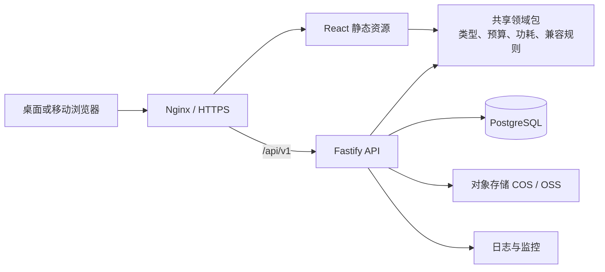

# PC 装机系统 MVP 技术方案

- 文档版本：v1.0
- 对应产品版本：MVP v0.2（第一版更新）
- 更新时间：2026-09-08
- 适用区域：中国大陆
- 文档状态：实现与验证中

## 1. 方案摘要

本项目采用 TypeScript 全栈、前后端分离的模块化单体架构。在保留现有 React + Vite 原型的基础上，使用 Fastify API、PostgreSQL 数据库、对象存储和确定性智能推荐引擎，不在 MVP 阶段引入微服务、消息队列或独立搜索集群。

推荐技术组合如下：

| 层级 | 选型 | 说明 |
| --- | --- | --- |
| Web 前端 | React 19、Vite、TypeScript | 延续现有原型，适合高交互装机工作台 |
| 页面路由 | React Router | 支持首页、装机工作台、分享页和管理后台 |
| 服务端数据 | TanStack Query | 管理配件查询、缓存、加载和错误状态 |
| 数据校验 | Zod | 前后端共享请求、响应和领域对象约束 |
| API 服务 | Node.js 24 LTS、Fastify 5 | 轻量、类型友好，适合模块化单体 API |
| 数据访问 | Drizzle ORM、SQL migrations | 保持 SQL 可见性，便于控制结构化规格和索引 |
| 数据库 | PostgreSQL 17 | 存储配件、配置单、管理员和分析事件 |
| 文件存储 | 腾讯云 COS 或阿里云 OSS | 存储配件图片，业务代码仅依赖 S3 兼容接口 |
| 测试 | Vitest、React Testing Library、Playwright | 覆盖规则、组件、API 和完整用户流程 |
| 部署 | Docker、Nginx、腾讯云或阿里云 | 默认中国大陆地域，同域名部署降低网络和鉴权复杂度 |

生产环境只使用处于支持期内的 Node.js LTS 版本。当前基线选择 Node.js 24 LTS；升级大版本时应单独完成兼容性验证，不与业务功能发布混合进行。

## 2. 目标与非目标

### 2.1 技术目标

- 支持八类核心配件选择、即时预算和功耗汇总。
- 对产品文档列出的兼容规则给出兼容、警告或不兼容结论。
- 支持匿名用户本地草稿、服务端配置保存和不可枚举的分享链接。
- 支持按配件类别与品牌浏览目录，并将通过完整性和兼容检查的匿名用户配置公开投稿。
- 支持管理员维护配件、价格、结构化规格和上下架状态。
- 根据预算、用途和偏好生成三套完整、可解释且经过兼容复核的推荐方案。
- 支持桌面端和移动端，核心交互具备自动化回归测试。
- 所有生产数据和服务部署在中国大陆可稳定访问的基础设施上。
- 保持云厂商可替换性，避免核心业务依赖专有函数或专有数据库能力。

### 2.2 MVP 非目标

- 不拆分微服务，不引入 Kubernetes。
- 不引入 Redis、Kafka、Elasticsearch；出现经过测量的瓶颈后再评估。
- 不实现通用的可视化兼容规则编辑器。
- 不实现普通用户复杂账号体系；首期仅要求管理员登录。
- 不实现开放式多轮 AI 对话、价格爬虫、支付、订单和电商跳转归因。
- 不把兼容性判断交给大语言模型。

## 3. 总体架构



采用同域名部署：Nginx 提供前端静态文件，并将 `/api/v1/*` 反向代理到 Fastify。这样可以避免跨域配置和跨站 Cookie 问题，也便于统一 HTTPS、限流和访问日志。

配件图片使用对象存储和独立静态域名。首期可以直接使用对象存储域名；访问量增长后再接入 CDN。

## 4. 代码组织

项目继续使用 npm，并升级为 npm workspaces，避免同时引入新的包管理器。

```text
apps/
  web/                  React + Vite 前端
  api/                  Fastify API
packages/
  domain/               配件类型、预算、功耗和兼容规则
  contracts/            Zod API 契约和共享 DTO
  database/             Drizzle schema、migration 和 seed
docs/                   产品、技术和运维文档
tests/
  e2e/                  Playwright 端到端测试
```

依赖方向必须保持为：`web -> contracts/domain`、`api -> contracts/domain/database`。`domain` 不得依赖 React、Fastify、数据库或云厂商 SDK，从而保证兼容规则可在浏览器、API 和单元测试中复用。

## 5. 前端方案

### 5.1 页面路由

| 路由 | 页面 | 访问权限 |
| --- | --- | --- |
| `/` | 预算、用途和开始入口 | 公开 |
| `/builder` | 装机工作台 | 公开 |
| `/configurations` | 单个配件分类与品牌总览 | 公开 |
| `/recommend` | 官方与用户投稿的完整配置方案 | 公开 |
| `/builds/:shareCode` | 分享配置单 | 公开但不可枚举 |
| `/saved` | 当前浏览器保存的草稿 | 公开 |
| `/admin/login` | 管理员登录 | 公开 |
| `/admin/parts` | 配件管理 | 管理员 |
| `/admin/parts/:id` | 配件编辑 | 管理员 |

配件详情首期使用工作台内抽屉或弹窗，不必单独增加公开路由。分享页必须能在没有本地状态的情况下通过 API 完整恢复配置。

### 5.2 状态分层

- 表单临时状态、当前步骤和弹窗状态使用 React 本地状态。
- 当前配置选择使用领域对象 `BuildDraft`，并写入带版本号的 `localStorage` 草稿。
- 配件列表、用户投稿列表、筛选结果和分享配置使用 TanStack Query 管理。
- 不在 MVP 引入 Redux；当出现多页面复杂客户端工作流且 React 状态难以维护时再评估。

本地草稿格式必须包含 `schemaVersion`。读取旧版本失败时保留原数据并提示用户重新开始，不能静默产生错误配置。

### 5.3 交互原则

- 每次选择配件后立即在浏览器内执行兼容检查，无需等待网络请求。
- 明确不兼容的候选项仍可展示，但必须禁用选择或要求用户先更换冲突配件。
- 警告项允许选择，并展示触发规则、涉及配件和人工确认建议。
- 保存和分享前由 API 使用同一版本领域规则再次校验，服务端结果为持久化依据。
- 移动端优先保证逐步选择、返回修改和查看汇总，不强求与桌面端相同的并排布局。

## 6. API 服务方案

### 6.1 模块划分

- `catalog`：分类、配件、筛选和详情。
- `compatibility`：权威兼容校验与规则版本。
- `recommendations`：约束搜索、用途评分、方案解释与推荐版本。
- `builds`：配置保存、分享和读取。
- `published-configurations`：用户配置投稿、服务端复核和公开列表。
- `admin-auth`：管理员登录、会话和退出。
- `admin-catalog`：配件新增、编辑、上下架和图片管理。
- `analytics`：匿名产品事件采集。
- `health`：存活和就绪检查。

### 6.2 API 草案

| 方法与路径 | 用途 | 权限 |
| --- | --- | --- |
| `GET /api/v1/categories` | 获取配件分类 | 公开 |
| `GET /api/v1/parts` | 按分类、品牌、价格和关键词筛选 | 公开 |
| `GET /api/v1/parts/:id` | 获取配件详情 | 公开 |
| `POST /api/v1/compatibility/check` | 服务端兼容校验 | 公开、限流 |
| `POST /api/v1/recommendations` | 生成三套智能推荐方案 | 公开、限流 |
| `POST /api/v1/builds` | 保存并生成分享码 | 公开、限流 |
| `GET /api/v1/builds/:shareCode` | 获取分享配置 | 公开 |
| `GET /api/v1/configurations` | 获取用户投稿的完整配置 | 公开 |
| `POST /api/v1/configurations` | 检查并发布当前完整配置 | 公开、同源校验、严格限流 |
| `POST /api/v1/admin/sessions` | 管理员登录 | 公开、严格限流 |
| `DELETE /api/v1/admin/sessions/current` | 管理员退出 | 管理员 |
| `POST /api/v1/admin/parts` | 新增配件 | 管理员 |
| `PATCH /api/v1/admin/parts/:id` | 修改配件和上下架状态 | 管理员 |
| `POST /api/v1/events` | 写入匿名产品事件 | 公开、限流 |

API 使用 JSON，统一返回 `requestId`。业务错误返回稳定错误码，例如 `PART_NOT_FOUND`、`BUILD_INCOMPATIBLE`、`VALIDATION_FAILED`，前端不得依赖可变的中文错误文本判断逻辑。

所有请求参数和响应体均通过 Zod schema 校验。Fastify 路由必须声明响应结构，禁止把数据库实体原样返回给浏览器。

## 7. 数据模型

### 7.1 核心表

| 表 | 关键字段 | 用途 |
| --- | --- | --- |
| `part_categories` | `id`, `code`, `name`, `sort_order` | 八类配件分类 |
| `parts` | `id`, `category_id`, `brand`, `model`, `name`, `price_fen`, `image_key`, `status`, `updated_at` | 配件公共信息 |
| `cpu_specs` | `part_id`, `socket`, `tdp_w`, `max_power_w` | CPU 兼容字段 |
| `motherboard_specs` | `part_id`, `socket`, `chipset`, `memory_type`, `form_factor`, `bios_notes` | 主板兼容字段 |
| `memory_specs` | `part_id`, `memory_type`, `capacity_mb`, `module_count` | 内存兼容字段 |
| `gpu_specs` | `part_id`, `length_mm`, `power_w` | 显卡兼容字段 |
| `case_specs` | `part_id`, `supported_form_factors`, `max_gpu_length_mm`, `max_cooler_height_mm` | 机箱兼容字段 |
| `cooler_specs` | `part_id`, `height_mm`, `supported_sockets` | 散热器兼容字段 |
| `psu_specs` | `part_id`, `rated_power_w` | 电源兼容字段 |
| `storage_specs` | `part_id`, `interface`, `capacity_gb`, `power_w` | 硬盘字段 |
| `builds` | `id`, `share_code_hash`, `name`, `budget_fen`, `usage`, `rule_version`, `created_at` | 已保存配置 |
| `build_items` | `build_id`, `category_id`, `part_id`, `price_snapshot_fen`, `part_snapshot` | 配置项和历史快照 |
| `build_check_results` | `build_id`, `rule_id`, `level`, `message`, `details` | 保存时的兼容结果 |
| `published_configurations` | `anonymous_id`, `author_name`, `name`, `configuration_class`, `selected_part_ids`, `parts_snapshot`, `checks_snapshot`, `summary_snapshot` | 通过复核的用户公开投稿 |
| `admin_users` | `id`, `username`, `password_hash`, `status` | 管理员 |
| `admin_sessions` | `id_hash`, `admin_user_id`, `expires_at`, `last_seen_at` | 可撤销后台会话 |
| `audit_logs` | `actor_id`, `action`, `target_type`, `target_id`, `changes`, `created_at` | 后台变更追踪 |
| `analytics_events` | `event_name`, `anonymous_id`, `build_id`, `properties`, `created_at` | MVP 指标事件 |

### 7.2 建模约束

- 金额统一使用人民币分的整数，禁止使用浮点数保存价格。
- 功耗统一使用 W，长度统一使用 mm，容量明确使用 MB 或 GB。
- 参与兼容判断的规格必须是结构化字段，不能只存在于展示文本或 JSON 中。
- `parts.display_specs` 可以使用 JSONB 保存不参与判断的展示规格。
- 配件使用软下架，不物理删除已被配置单引用的数据。
- 配置单保存名称、价格和关键规格快照，确保配件改价或下架后历史分享仍可解释。
- `shareCode` 使用密码学安全随机值，数据库只保存其哈希；禁止使用递增 ID 作为公开分享地址。
- 所有公开查询必须过滤未上架配件，但历史分享允许读取自身快照。
- 投稿中的 `anonymous_id` 仅用于匿名产品标识，不随公开配置响应返回；公开昵称由用户主动填写。

## 8. 兼容性引擎

### 8.1 实现方式

兼容规则以代码形式保存在 `packages/domain`，而不是由管理员编写任意表达式。规则元数据包含稳定 `ruleId`、版本、涉及分类和说明。

```ts
type CompatibilityLevel = "compatible" | "warning" | "incompatible";

interface CompatibilityResult {
  ruleId: string;
  ruleVersion: string;
  level: CompatibilityLevel;
  message: string;
  relatedPartIds: string[];
  details?: Record<string, unknown>;
}
```

每条规则是无副作用的纯函数。输入为标准化的 `BuildSnapshot`，输出零个或多个结果。规则集合统一执行并按“不兼容、警告、兼容”排序。

### 8.2 MVP 规则清单

| 规则 ID | 判断 |
| --- | --- |
| `cpu-motherboard-socket` | CPU 和主板插槽一致 |
| `cpu-chipset-support` | CPU 型号受到主板芯片组支持 |
| `motherboard-memory-generation` | 主板与内存代际一致 |
| `case-motherboard-form-factor` | 机箱支持主板尺寸 |
| `case-gpu-clearance` | 显卡长度不超过机箱限长 |
| `cooler-cpu-socket` | 散热器支持 CPU 插槽 |
| `case-cooler-clearance` | 散热器高度不超过机箱限高 |
| `psu-power-headroom` | 额定功率覆盖估算功耗和安全余量 |
| `bios-version-review` | CPU 与芯片组组合可能要求特定 BIOS，返回警告 |

功耗估算首期使用各配件峰值或保守功耗之和，并加入主板、风扇和外设基础功耗。电源规则使用可配置的安全余量，默认最低余量为 35%。所有公式、常量和例外必须通过表驱动测试固定预期。

数据库中的管理员可以修改配件规格，但不能修改规则代码。规则变化必须经过代码审查、测试和发布，并递增 `ruleVersion`。

### 8.3 智能推荐引擎

首版推荐引擎位于 `packages/domain`，与兼容规则一样保持无框架依赖和确定性。输入为预算、用途及紧凑机身、低功耗、方便升级等受控偏好；输出为均衡、性能优先和性价比优先三套完整配置。

推荐过程遵循以下顺序：

1. 只读取当前上架的八类配件。
2. 搜索 CPU、主板、内存、显卡、机箱和散热器的兼容组合。
3. 根据用途选择容量和预算档位合适的存储，并计算满足 35% 余量的电源。
4. 按用途性能、预算贴合度、价格效率和用户偏好分别评分。
5. 使用完整兼容规则复核，过滤任何明确不兼容的方案。
6. 返回稳定 `recommendationVersion`、推荐理由和取舍说明。

后续接入大语言模型时，大模型只把自然语言转换为受控偏好，或对已经计算出的结果生成解释。模型输出必须通过 Zod 校验，禁止虚构配件 ID、价格、功耗或兼容结论；模型不可用时自动退回当前确定性推荐。

## 9. 保存与分享

用户装机过程默认保存在浏览器本地，不上传个人信息。用户点击“生成分享链接”时执行：

1. 前端提交预算、用途和八类配件 ID。
2. API 读取当前上架配件并重新计算价格、功耗和兼容结果。
3. 若存在明确不兼容项，API 默认拒绝生成分享链接；产品若允许强制分享，应显式记录风险确认。
4. API 在单个数据库事务中写入 `builds`、`build_items` 和 `build_check_results`。
5. API 返回只显示一次的随机分享码和完整分享地址。
6. 分享页根据分享码读取快照，不依赖浏览器本地状态。

首期分享链接为“获得链接即可查看”，不提供搜索、列表或公开索引入口。后续增加账号体系时，可以为配置单补充所有权，而不改变公开分享模型。

### 9.1 用户配置投稿

用户点击“上传我的配置”后，前端只提交当前草稿中的八类配件 ID、公开称呼、方案名称、分类和可选推荐理由。API 再次读取当前在售配件，拒绝缺项、分类错位、下架或明确不兼容的组合，并把通过检查的配件、规则结果和汇总快照写入 `published_configurations`。列表最多返回最近 200 条投稿，普通用户无需账号；第一版不提供评论、点赞、编辑或删除等社区功能。

## 10. 管理后台与安全

### 10.1 管理员认证

- 首个管理员通过部署脚本创建，不提供公开注册入口。
- 密码使用 Argon2id 哈希，禁止明文或可逆加密保存。
- 登录成功后使用随机、不透明、可撤销的服务端会话。
- Cookie 设置 `HttpOnly`、`Secure` 和适当的 `SameSite` 属性。
- 登录接口按 IP 和用户名组合限流，并记录失败审计事件。
- 管理写操作校验 Origin/CSRF，并要求同域 HTTPS。
- 管理员修改配件、价格、规格和状态均写入 `audit_logs`。

### 10.2 通用安全

- 数据库不暴露公网，只允许 API 所在私有网络访问。
- 数据库账号使用最小权限；migration 账号与运行时账号分离。
- 对象存储上传使用服务端签名，限制文件类型、大小和 Key 前缀。
- API 请求体设置大小上限，公开写接口设置速率限制。
- Nginx 设置安全响应头；前端不使用不受控的 HTML 注入。
- 密钥只通过云密钥管理或运行环境注入，不写入仓库和镜像。
- 日志禁止记录密码、Cookie、完整分享码或其他敏感值。
- 依赖更新由自动化工具提出，但必须通过测试和人工评审后合并。

## 11. 产品分析事件

首期采用第一方事件表，不依赖境外分析 SaaS。只收集衡量 MVP 所需的最小事件：

| 事件 | 关键属性 |
| --- | --- |
| `build_started` | 用途、预算区间 |
| `part_selected` | 分类、步骤序号 |
| `compatibility_triggered` | 规则 ID、级别、涉及分类 |
| `part_changed_after_warning` | 规则 ID、原分类 |
| `build_completed` | 用时、预算区间、总价区间 |
| `build_saved_local` | 完成度 |
| `build_shared` | 完成度、是否有警告 |
| `recommendation_generated` | 用途、预算区间、返回方案数 |
| `recommendation_applied` | 推荐策略、总价区间 |
| `configuration_published` | 配置分类、总价区间 |

浏览器首次使用时生成随机 `anonymousId`，不做设备指纹识别，不采集精确 IP 作为分析属性。事件属性使用白名单校验，设置保留期限，并在隐私政策中说明用途。

## 12. 测试策略

### 12.1 测试分层

- 领域单元测试：预算、功耗、所有兼容规则和边界值，使用 Vitest 表驱动测试。
- 前端组件测试：步骤切换、筛选、冲突提示、汇总和草稿恢复，使用 React Testing Library。
- API 集成测试：请求校验、数据库事务、权限、限流和错误码。
- 数据库测试：migration 可从空库执行，约束和索引符合预期。
- 端到端测试：使用 Playwright 覆盖 Chromium、WebKit 和移动端视口。
- 安全测试：管理员越权、会话过期、CSRF、非法上传和分享码枚举保护。

### 12.2 必测业务矩阵

- 相同和不同 CPU 插槽。
- DDR4 与 DDR5 的正反组合。
- ATX、M-ATX、ITX 与各类机箱组合。
- 显卡长度等于、短于和长于机箱限制。
- 散热高度等于、短于和长于机箱限制。
- 散热器支持多个插槽和不支持当前插槽。
- 电源不足、余量不足和余量充足。
- 多个问题同时存在时结果完整且顺序稳定。
- 配件下架或改价后，历史分享快照仍可读取。
- 手机端从开始装机到分享配置的完整流程。
- 三种推荐策略完整、结果稳定、不含下架配件且不存在明确兼容冲突。
- 推荐方案可以在桌面端和手机端一键导入工作台。

每次变更必须同时更新相关测试。合并前至少通过类型检查、Lint、单元测试、API 集成测试、端到端关键路径和生产构建。

## 13. 部署方案

### 13.1 默认中国大陆拓扑

基准环境选择腾讯云；使用阿里云时采用括号内等价产品：

| 能力 | 腾讯云基线 | 阿里云等价方案 |
| --- | --- | --- |
| 应用主机 | CVM | ECS |
| PostgreSQL | TencentDB for PostgreSQL | RDS PostgreSQL |
| 图片存储 | COS | OSS |
| CDN | 腾讯云 CDN | 阿里云 CDN |
| 日志 | CLS | SLS |
| 密钥管理 | KMS/Secrets Manager | KMS/凭据管家 |

应用主机、数据库和对象存储必须选择同一地域。具体地域根据首批用户分布和团队运维位置确定，不在代码中硬编码。数据库使用托管服务的自动备份；正式公开上线优先选择高可用规格，封闭测试阶段可使用基础规格控制成本。

### 13.2 容器与环境

- `web-build` 生成静态资源，由 Nginx 提供。
- `api` 使用多阶段 Docker 构建，运行非 root 用户和只读文件系统。
- 本地开发使用 Docker Compose 启动 PostgreSQL、API 和 Web。
- 环境分为 `development`、`staging`、`production`，数据库和对象存储完全隔离。
- migration 在发布任务中单独执行；API 启动时不得自动修改生产数据库结构。
- 数据库变更遵循先扩展、再切换、后清理，保证可回滚发布。

### 13.3 发布流程

1. 拉取请求运行类型检查、Lint、单元测试、集成测试和构建。
2. 合并主分支后构建带 Git SHA 的不可变镜像。
3. 自动部署至 staging 并执行 migration 与 Playwright 冒烟测试。
4. 人工批准后部署 production。
5. 执行健康检查和关键业务冒烟测试。
6. 失败时回滚应用镜像；数据库使用向后兼容 migration，避免紧急回滚数据库。

## 14. 可观测性与备份

- Fastify 使用结构化 JSON 日志，为每个请求生成 `requestId`。
- 记录请求耗时、状态码、路由模板、数据库耗时和规则执行耗时。
- 监控 API 5xx 比例、P95 延迟、数据库连接数、慢查询、磁盘和备份状态。
- 健康检查分为 `/health/live` 和 `/health/ready`；就绪检查验证数据库连接。
- 配置错误率、分享失败率和登录失败激增告警。
- PostgreSQL 开启自动备份，并定期执行恢复演练；不能只验证“备份任务成功”。
- 对象存储开启版本控制或生命周期策略，避免管理员误覆盖图片后无法恢复。

## 15. 中国大陆合规与上线前置项

以下内容属于上线清单，不替代法律意见：

- 使用中国大陆服务器并通过自有域名公开服务前，完成适用的 ICP 备案。
- 全站 HTTPS，域名、备案主体和云资源归属关系符合云厂商接入要求。
- 提供隐私政策和用户协议，说明本地草稿、匿名分析事件和日志用途。
- 遵循最小必要原则采集数据，为分析事件设置明确保留期限和删除机制。
- 若后续增加手机号、邮箱、支付、外部大模型服务或第三方电商跳转，重新进行隐私和合规评审。
- 配件图片和参数必须确认来源、授权和更新责任，后台保留来源与最后核验时间。

## 16. 分阶段实施计划

### 阶段 A：工程基线

- 将现有 JavaScript 迁移为 TypeScript。
- 建立 npm workspaces 和 `domain`、`contracts`、`database` 包。
- 将现有兼容逻辑迁入纯领域包，补齐规则矩阵测试。
- 接入 React Router，保持当前页面和交互可用。

完成标准：现有功能无回归，类型检查、单元测试和生产构建通过。

### 阶段 B：数据与后台

- 建立 PostgreSQL schema、migration 和 50～100 个配件种子数据。
- 实现公开配件 API、管理员认证和配件管理。
- 接入对象存储图片上传和审计日志。

完成标准：管理员可以安全维护配件，前端不再依赖硬编码配件数据。

### 阶段 C：保存、分享与完整兼容校验

- 实现服务端兼容复核、配置事务保存和分享页。
- 实现确定性智能推荐、三种策略和一键导入工作台。
- 实现浏览器版本化草稿与异常恢复。
- 补齐 CPU/芯片组/BIOS 和所有尺寸、功耗规则。

完成标准：八类配件可以完整选择、保存和分享，历史快照稳定可读。

### 阶段 D：大陆部署与验证

- 建立 staging、production、HTTPS、日志、监控和备份。
- 完成桌面和移动端 Playwright 测试、压力冒烟和恢复演练。
- 接入第一方分析事件并核对指标口径。
- 完成 ICP、隐私政策和内容来源检查等上线前置项。

完成标准：满足产品设计文档 MVP 验收标准并可小流量发布。

## 17. 容量与演进触发条件

MVP 以 50～100 个配件、单实例 API 和单主库为基线。扩容必须由监控数据触发：

- API CPU 或 P95 延迟持续超标：先优化查询和缓存，再水平扩展无状态 API。
- 配件读取成为主要数据库负载：增加 HTTP/CDN 缓存，再考虑 Redis。
- 模糊搜索无法满足准确率或性能：先使用 PostgreSQL 索引和全文检索，再评估独立搜索服务。
- 分析事件影响交易型查询：先分区和归档，再迁移至独立分析存储。
- 只有当模块需要独立扩缩容、发布或团队所有权时，才考虑拆分服务。

## 18. 关键决策记录

| 决策 | 结论 | 原因 |
| --- | --- | --- |
| 是否改用 Next.js | 否 | 当前产品是高交互 SPA，现有 Vite 原型可直接演进 |
| 是否使用 Supabase 托管后端 | 否 | 目标用户在中国大陆，优先采用境内可稳定访问的基础设施 |
| 是否自建 PostgreSQL | 否 | MVP 使用托管数据库降低备份、高可用和升级负担 |
| 是否使用微服务 | 否 | 当前业务和团队规模不需要额外分布式复杂度 |
| 兼容规则存储位置 | TypeScript 领域包 | 可测试、可版本化，并可在浏览器和服务端复用 |
| 普通用户是否必须登录 | 否 | 降低首次装机阻力，分享时保存匿名配置 |
| 管理后台认证方式 | 服务端会话 | 会话可撤销，适合少量管理员和同域部署 |
| 产品分析方案 | 第一方事件表 | 满足 MVP 指标，同时减少境外依赖和非必要数据采集 |
| AI 推荐首版方式 | 确定性约束搜索，预留模型解析接口 | 保证兼容、预算和功耗结论可测试，且不依赖外部模型可用性 |

## 19. 参考资料

- [Node.js 发布与 LTS 策略](https://nodejs.org/en/about/previous-releases)
- [Fastify TypeScript 文档](https://fastify.dev/docs/latest/Reference/TypeScript/)
- [Fastify Validation and Serialization](https://fastify.dev/docs/latest/Reference/Validation-and-Serialization/)
- [Vite 官方指南](https://vite.dev/guide/)
- [React Router 模式说明](https://reactrouter.com/start/modes)
- [Playwright 官方文档](https://playwright.dev/)
- [腾讯云 PostgreSQL 产品文档](https://cloud.tencent.com/document/product/409)
- [腾讯云 COS CDN 配置](https://cloud.tencent.com/document/product/436/18670)
- [阿里云 RDS PostgreSQL 文档](https://help.aliyun.com/zh/rds/apsaradb-rds-for-postgresql/what-is-apsaradb-rds-for-postgresql/)
- [工业和信息化部 ICP/IP 地址/域名信息备案管理系统](https://beian.miit.gov.cn/)
